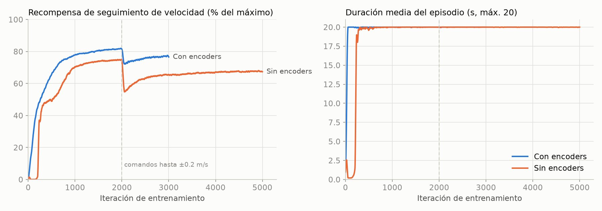

# Comparativa: política con encoders vs. sin encoders

Este documento compara las dos políticas de marcha entrenadas para el Pentabot:

| | **Con encoders** (`Pentabot-Flat`) | **Sin encoders** (`Pentabot-Flat-SinEncoder`) |
|---|---|---|
| Para qué sirve | primera prueba en simulación | **la que se puede llevar al robot real** |
| Entradas del actor | 56: IMU, comando, fase, **posición y velocidad de las 15 articulaciones**, última acción | 130: IMU, comando, fase y última acción, con **historial de 5 pasos** (100 ms) |
| ¿Funciona con el MG995 real? | **No**: el MG995 no informa de su posición | **Sí**: solo usa lo que la ESP32 puede medir |
| Red del actor | 56 → 256 → 128 → 128 → 15 | 130 → 256 → 128 → 128 → 15 (~84 000 parámetros) |
| Aleatorización al entrenar | moderada (kp ×0.8–1.2, retardo 0–20 ms, cero ±1.7°) | dura: kp ×0.6–1.4, retardo 4–32 ms, cero ±3°, juego de engranajes, IMU con sesgo, torso ×0.8–1.4 |
| Entrenamiento | 3000 iteraciones, ~3 h | 5000 iteraciones, ~5 h |
| Archivos | `politica/model_3000.pt`, `politica/policy.onnx` | `politica/sin_encoder/model_5000.pt`, `politica/sin_encoder/policy.onnx` |

<table>
<tr><th>Con encoders</th><th>Sin encoders</th></tr>
<tr>
<td></td>
<td></td>
</tr>
<tr><td colspan="2"><i>Las dos con la misma secuencia: parado → avance 0.16 m/s → giro 0.48 rad/s → lateral 0.16 m/s.</i></td></tr>
</table>

## Resumen

> **La política sin encoders es la mejor candidata para el robot real.** Con la aleatorización de robot
> real, la versión con encoders se cae entre el 6 y el 10 % de las veces y lleva los servos al límite.
> La versión sin encoders no se cae nunca, sigue la velocidad igual o mejor y deja un 15–25 % de margen
> de par.

- **Velocidad:** en sus propias condiciones, la versión con encoders sigue mejor la velocidad (85–98 %
  frente a 83–89 %). Es lo esperable, porque sabe dónde está cada pata. En condiciones de robot real
  quedan parecidas, y en diagonal la versión sin encoders es mucho mejor (87 % frente a 54 %).
- **Caídas:** con encoders se cae el 6–10 % de las veces en condiciones reales; sin encoders, 0 %.
- **Par de los servos:** la versión con encoders tiene el p95 del par **al 100 % del límite** en todos
  los comandos, incluso parada. Es decir, vive con los servos saturados, algo que un MG995 real no
  aguantaría mucho tiempo. La versión sin encoders camina al 74–82 %. Se penalizó la saturación
  (`saturacion_servo`) y el par (`torques`) precisamente por esto.

## Curvas de entrenamiento



- La versión sin encoders **tardó ~250 iteraciones en dejar de caerse**, por la aleatorización dura del
  arranque. Después aprendió a un ritmo parecido al de la versión con encoders.
- En la iteración 2000 el currículo duplica el rango de comandos, hasta ±0.2 m/s y ±0.6 rad/s. Las dos
  caen y se recuperan.
- La recompensa de seguimiento es un kernel exponencial (std 0.1 m/s), **no un porcentaje de velocidad**.
  La versión sin encoders termina en ~67 % del máximo frente al ~77 % de la versión con encoders, pero
  en velocidad real están mucho más cerca (ver abajo).

## Evaluación en condiciones de robot real

Se usó `mjlab/scripts/evaluar_sin_encoder.py` con 256 robots en paralelo. Cada robot tiene su propio
servo (kp ×0.6–1.4, par ±20 %, retardo 4–32 ms, cero ±3°, juego de engranajes ±1°), su propia masa
(torso ×0.8–1.4) y su propia fricción (0.4–1.2). El IMU lleva ruido, sesgo fijo y hasta 20 ms de
retardo. Por cada comando se mide durante 8 s, tras 2 s de arranque.


| Comando | Sigue (con / sin) | Caídas (con / sin) | < 3 pies (con / sin) | Par p95 (con / sin) | Inclinación (con / sin) |
|---|---|---|---|---|---|
| adelante 0.20 m/s | 84 % / 83 % | **7.0 %** / 0 % | 9.4 % / 2.9 % | **100 %** / 82 % | 2.2° / 1.3° |
| adelante 0.10 m/s | 80 % / 85 % | **6.2 %** / 0 % | 5.8 % / 0.6 % | **100 %** / 74 % | 2.0° / 1.2° |
| atrás 0.15 m/s | 81 % / 88 % | **7.4 %** / 0 % | 6.5 % / 1.2 % | **100 %** / 79 % | 2.3° / 2.0° |
| lateral 0.15 m/s | 86 % / 89 % | **9.8 %** / 0 % | 7.6 % / 1.2 % | **100 %** / 80 % | 2.2° / 1.3° |
| diagonal 0.10 m/s | **54 %** / 87 % | 0.8 % / 0 % | 3.1 % / 0.5 % | **100 %** / 75 % | 1.9° / 1.2° |
| giro 0.50 rad/s | 86 % / 84 % | **7.8 %** / 0 % | 6.7 % / 0.6 % | **100 %** / 79 % | 2.3° / 1.5° |
| quieto | — | 0 % / 0 % | 0.1 % / 0 % | **100 %** / 85 % | 1.0° / 0.8° |

### Cada una en sus propias condiciones de entrenamiento

Como referencia, cada política evaluada con la aleatorización con la que se entrenó:

| Comando | Sigue (con / sin) | Caídas (con / sin) | Par p95 (con / sin) |
|---|---|---|---|
| adelante 0.20 m/s | 92 % / 83 % | 0 % / 0 % | 100 % / 76 % |
| adelante 0.10 m/s | 89 % / 85 % | 0 % / 0 % | 100 % / 68 % |
| atrás 0.15 m/s | 90 % / 87 % | 0 % / 0 % | 100 % / 74 % |
| lateral 0.15 m/s | 95 % / 89 % | 0 % / 0 % | 100 % / 73 % |
| diagonal 0.10 m/s | 85 % / 87 % | 0 % / 0 % | 100 % / 70 % |
| giro 0.50 rad/s | 98 % / 84 % | 0 % / 0 % | 100 % / 74 % |
| quieto | — | 0 % / 0 % | 100 % / 95 % |

La versión con encoders es muy buena *en el mundo en el que se entrenó*, pero se degrada al cambiar de
servo, de masa o de IMU. La versión sin encoders prácticamente no cambia entre los dos escenarios. Esa
robustez es lo que hace falta para pasar de la simulación al robot real.

## Limitaciones y advertencias

1. **El par en parado sigue alto con la política sin encoders: p95 del 85–95 %.** Con las 5 patas
   apoyadas, un error de cero del servo de 3° hace que los servos se empujen entre sí. Para un kp de
   11.2 N·m/rad, 0.05 rad suponen 0.56 N·m, el 57 % del bloqueo. **Hay que calibrar cada servo con un
   error menor de 1°.**
2. **El par máximo no variaba entre robots durante el entrenamiento.** La función `limites_par` no tenía
   el decorador `@requires_model_fields("actuator_forcerange")`. Por eso los 4096 robots compartían los
   mismos 15 límites (un sorteo por servo, igual para todos) en lugar de uno distinto por robot. Se
   corrigió después del entrenamiento y **todas las evaluaciones de este documento usan ya la versión
   corregida**. La política aguanta la variación de par por robot sin caerse, aunque no la vio al
   entrenar. El próximo entrenamiento ya la incluirá.
3. Es **simulación**. Los parámetros del MG995 (kp, fricción, inercia) son estimados, no medidos. Antes
   de confiar en estas cifras conviene medir la respuesta de un servo real y ajustar
   `mjlab/robot/pentabot_constants.py`.
4. La versión con encoders se evaluó en "condiciones reales" con un IMU y unos servos como los del
   robot real, pero leyendo encoders que el MG995 no tiene. Es una comparación hipotética, por si algún
   día se cambian los servos por unos con realimentación (por ejemplo, Dynamixel o servos de bus).

## Cómo reproducirlo

```bash
cd ~/unitree_rl_mjlab; unset PYTHONPATH; conda activate unitree_rl_mjlab
E=~/pentabot/politica/model_3000.pt
N=~/pentabot/politica/sin_encoder/model_5000.pt
for m in "encoders $E" "sin_encoder $N"; do set -- $m
  for c in propias reales; do
    python ~/pentabot/mjlab/scripts/evaluar_sin_encoder.py $2 --modelo $1 --condiciones $c --json $1_$c.json
  done
done
# Gráficas: lee los JSON de la carpeta indicada y los logs de tensorboard de los dos entrenamientos
# (las rutas de las corridas están al principio del script; los logs solo están en la máquina de Leo)
python ~/pentabot/mjlab/scripts/graficas_comparativa.py . ~/pentabot/imagenes
```

Los resultados en bruto están en [`docs/evaluaciones/`](docs/evaluaciones/).
