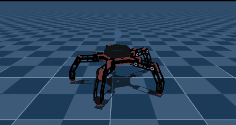
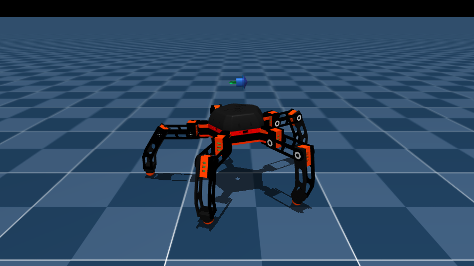
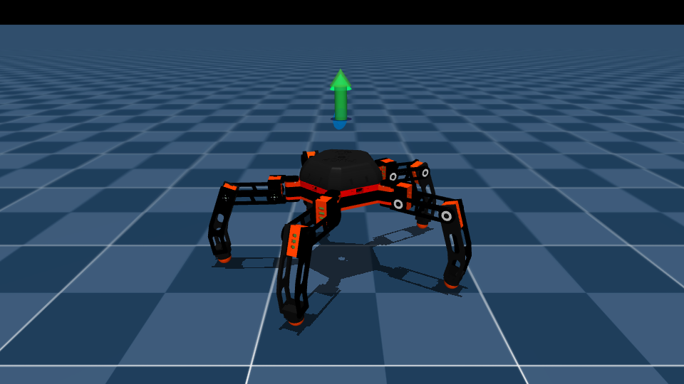
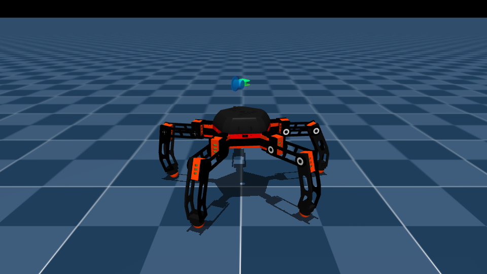
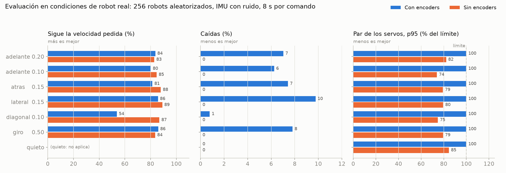

# Pentabot

> ¿Vas a trabajar en el proyecto desde otra computadora? Empieza por [`CONTEXTO.md`](CONTEXTO.md).
> Comparativa entre la política con encoders y la desplegable sin encoders: [`COMPARATIVA.md`](COMPARATIVA.md).

Robot caminante de **5 patas y 15 grados de libertad** (3 servos TowerPro MG995 por pata), modelado en
MuJoCo desde el CAD de Inventor y entrenado con aprendizaje por refuerzo (PPO) sobre
[mjlab](https://github.com/mujocolab/mjlab) / `unitree_rl_mjlab`.

La política principal **no necesita encoders**: solo usa el IMU, el comando del mando y sus propias
acciones anteriores. Así puede correr en el robot real, cuyos servos MG995 no informan de su posición.

<p align="center">
  
</p>

<p align="center"><i>Política sin encoders en simulación: parado → avance → giro → desplazamiento lateral.</i></p>

## Imágenes de la simulación

| Vista isométrica | Vista superior |
|---|---|
|  |  |

| Frente | Lateral |
|---|---|
|  |  |

| Geometría de colisión (cascos convexos + pies esféricos) | Pose del CAD |
|---|---|
|  |  |

| Avance (0.16 m/s) | Giro (0.48 rad/s) | Lateral (0.16 m/s) |
|---|---|---|
|  |  |  |

## Características

| | |
|---|---|
| Patas | 5, a 72° entre sí |
| Articulaciones | 15: `Lk_hip_yaw`, `Lk_hip_pitch`, `Lk_knee` (k = 1…5) |
| Servos | TowerPro MG995 a 6 V (par de bloqueo ≈ 0.98 N·m, sin realimentación de posición) |
| Masa del modelo | 2.47 kg |
| Altura del torso de pie | 0.196 m |
| Controlador previsto | ESP32 DevKit + PCA9685 + IMU, mando DualSense |

## Estado

| Fase | Estado |
|---|---|
| Modelo MuJoCo (`model/`) | Hecho y validado (`scripts/test_modelo.py`) |
| Política con encoders (`Pentabot-Flat`) | Hecha. Solo sirve como referencia en simulación |
| **Política sin encoders (`Pentabot-Flat-SinEncoder`)** | **Hecha**: 5000 iteraciones, ~5 h |
| Control con mando PS5 en simulación | Funciona con las dos políticas |
| Ejecutar la política en la ESP32 | Pendiente |

### Resultados en condiciones de robot real

Evaluación de 256 robots simulados. Cada uno tiene su propio servo (kp ×0.6–1.4, par ±20 %, retardo
4–32 ms, cero ±3°, juego de engranajes), su propia masa y su propia fricción. El IMU tiene ruido, sesgo
y retardo.

| | Con encoders | **Sin encoders** |
|---|---|---|
| Sigue la velocidad pedida | 54–86 % | **83–89 %** |
| Caídas | 6–10 % | **0 %** |
| Par de los servos (p95) | 100 % del límite | **74–82 %** caminando |
| ¿Funciona con el MG995 real? | No | **Sí** |



El detalle, las curvas de entrenamiento y las limitaciones están en [`COMPARATIVA.md`](COMPARATIVA.md).

> **Antes de probarlo en el robot real:** calibra cada servo con un error menor de 1°. Con las 5 patas
> apoyadas, un error de cero hace que los servos se empujen entre sí: en parado, la simulación da un par
> p95 del 85 %.

## Estructura

```
model/            pentabot.xml (robot) y scene.xml (robot + suelo); mallas STL en model/assets/
scripts/          visor, prueba del modelo y marcha de demostración en lazo abierto (solo MuJoCo)
mjlab/
  robot/          pentabot_constants.py: robot y actuadores MG995 para mjlab
  tarea/          env_cfgs.py (Pentabot-Flat), sin_encoder.py (Pentabot-Flat-SinEncoder), rl_cfg.py (PPO)
  scripts/        entrenar, ver, mando PS5, evaluar, gráficas de la comparativa y renders
politica/
  sin_encoder/    la política desplegable: model_5000.pt, policy.onnx, params/
  model_3000.pt   la política con encoders (referencia), con su policy.onnx y params/
docs/             MODELO.md (modelo), PENDIENTE.md (despliegue en la ESP32), evaluaciones/ (resultados en JSON)
imagenes/         renders, GIFs y gráficas
CONTEXTO.md       traspaso para trabajar en otra computadora: instalación, diseño y estado
COMPARATIVA.md    con encoders vs. sin encoders
```

## Uso rápido: solo el modelo en MuJoCo

```bash
bash setup.sh                # una vez: crea .venv con mujoco y prueba el modelo
bash ver.sh                  # visor con el robot de pie (sliders por servo)
bash ver.sh demo             # marcha de prueba en lazo abierto
python scripts/test_modelo.py   # estabilidad, carga por pie y pares (sin ventana)
```

## Entrenar y usar la política (con `unitree_rl_mjlab`)

La tarea se integra en [`unitree_rl_mjlab`](https://github.com/unitreerobotics/unitree_rl_mjlab) enlazando
las carpetas de este repo. La instalación completa, desde cero, está en [`CONTEXTO.md`](CONTEXTO.md#3-montarlo-en-tu-computadora).

```bash
U=~/unitree_rl_mjlab
ln -s ~/pentabot              $U/src/assets/robots/Pentabot_MuJoCo
ln -s ~/pentabot/mjlab/robot  $U/src/assets/robots/pentabot
ln -s ~/pentabot/mjlab/tarea  $U/src/tasks/velocity/config/pentabot
cp ~/pentabot/mjlab/scripts/{jugar_mando.py,mando_ps5.py} $U/
```

Y registrar el robot al final de `src/assets/robots/__init__.py`:

```python
from .pentabot.pentabot_constants import (
  PENTABOT_ACTION_SCALE as PENTABOT_ACTION_SCALE,
)
from .pentabot.pentabot_constants import (
  get_pentabot_robot_cfg as get_pentabot_robot_cfg,
)
```

Después:

```bash
cd ~/unitree_rl_mjlab
unset PYTHONPATH; source ~/miniconda3/etc/profile.d/conda.sh; conda activate unitree_rl_mjlab
N=~/pentabot/politica/sin_encoder/model_5000.pt

# Probar la política sin encoders
python jugar_mando.py $N --robot pentabot_sin_encoder                        # con el mando de PS5
python scripts/play.py Pentabot-Flat-SinEncoder --checkpoint_file=$N         # sin mando (comandos aleatorios)
python ~/pentabot/mjlab/scripts/evaluar_sin_encoder.py $N                    # evaluación numérica (~2 min)

# Entrenar (lanza en segundo plano + tensorboard en :6006)
~/pentabot/mjlab/scripts/entrenar_pentabot.sh 4096 Pentabot-Flat-SinEncoder

# Regenerar las imágenes de este README
python ~/pentabot/mjlab/scripts/grabar_marcha.py $N ~/pentabot/imagenes Pentabot-Flat-SinEncoder sin_encoder_
python ~/pentabot/mjlab/scripts/render_estatico.py
```

## Política sin encoders (`politica/sin_encoder/`)

- **Entradas del actor:** 130, es decir, 26 valores × 5 pasos de historial (100 ms). El historial va
  **por término**, cada uno del paso más viejo al más nuevo:

  | Posiciones | Término | Origen en el robot real |
  |---|---|---|
  | 0–14 | `base_ang_vel` (5 × 3) | giroscopio del IMU, rad/s |
  | 15–29 | `projected_gravity` (5 × 3) | orientación del IMU → gravedad unitaria en el marco del torso |
  | 30–44 | `command` (5 × 3) | stick del mando → vx, vy, wz |
  | 45–54 | `phase` (5 × 2) | reloj propio: sin/cos de 2π·t/0.8 s; (0, 0) si no se pide andar |
  | 55–129 | `actions` (5 × 15) | las acciones que la red envió en los pasos anteriores |

- **Red:** MLP 130 → 256 → 128 → 128 → 15 con ELU (~84 000 parámetros, ~336 KB en float32). El
  normalizador de las entradas va incluido en `policy.onnx`.
- **Salida:** `objetivo_articulación = 0.3 × acción` [rad], con la pose por defecto en q = 0. Funciona a 50 Hz.
- **Rango de comandos:** vx, vy ∈ [−0.2, 0.2] m/s; ωz ∈ [−0.6, 0.6] rad/s.
- **Diseño** (recompensas, aleatorización y por qué): [`CONTEXTO.md`](CONTEXTO.md#5-diseño-de-la-política-sin-encoders).

La política con encoders (`politica/model_3000.pt`) tiene 56 entradas, que incluyen `joint_pos` y
`joint_vel`. Se conserva como referencia de la [comparativa](COMPARATIVA.md).

## Próximos pasos

1. **Ejecutar la red en la ESP32**:
   - exportar `policy.onnx` a un `.h`;
   - escribir la MLP en C plano;
   - bucle a 50 Hz con el IMU y el mando DualSense por Bluetooth;
   - calibración por servo.
2. **Medir un MG995 real** (kp, fricción, velocidad) y ajustar `pentabot_constants.py`.
3. **Reentrenar** con la variación de par por robot ya corregida y con la medida del servo real.

El detalle está en [`docs/PENDIENTE.md`](docs/PENDIENTE.md) y en la sección 8 de [`CONTEXTO.md`](CONTEXTO.md).
