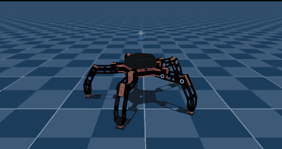
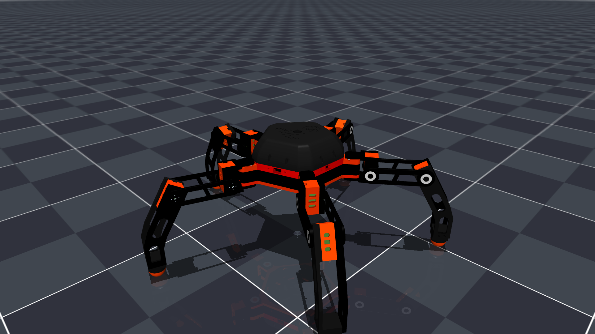
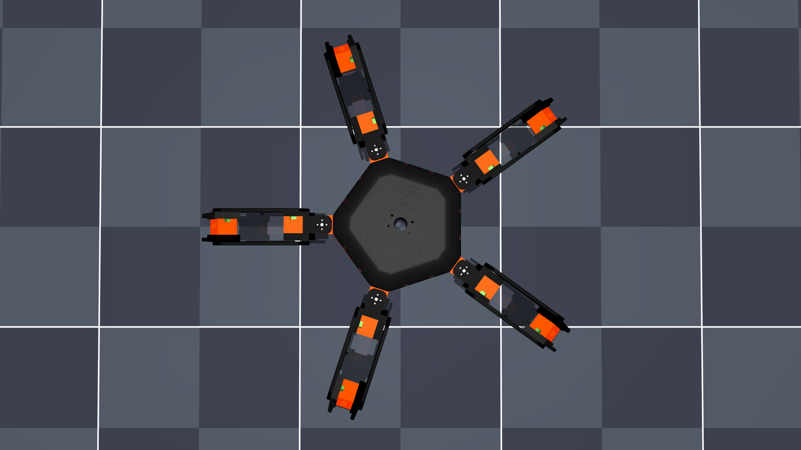
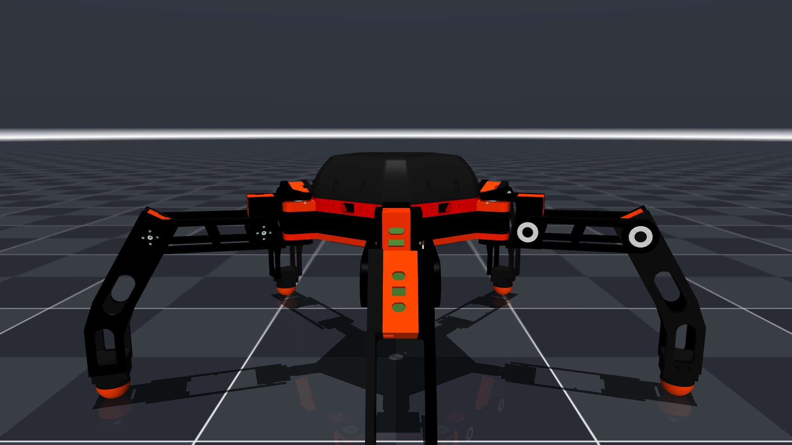
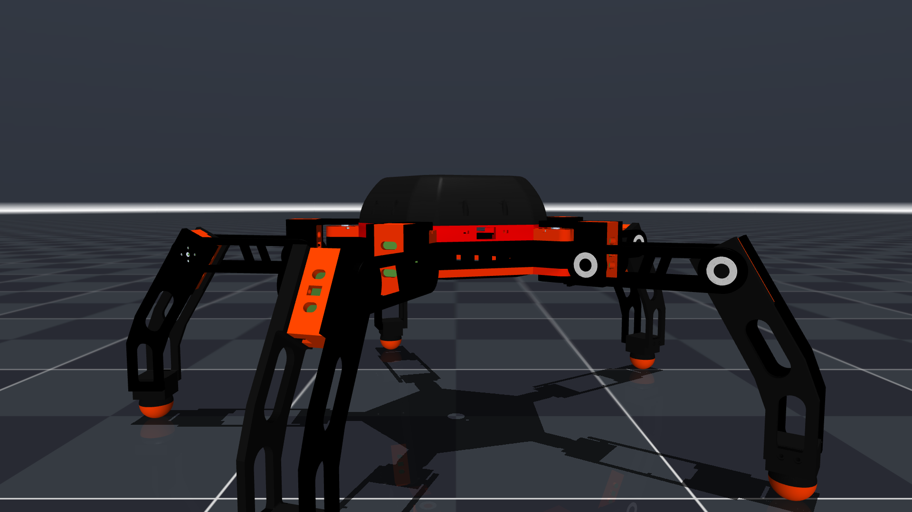
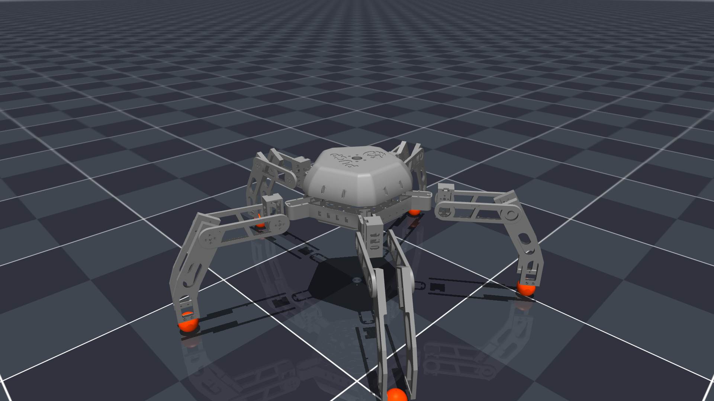
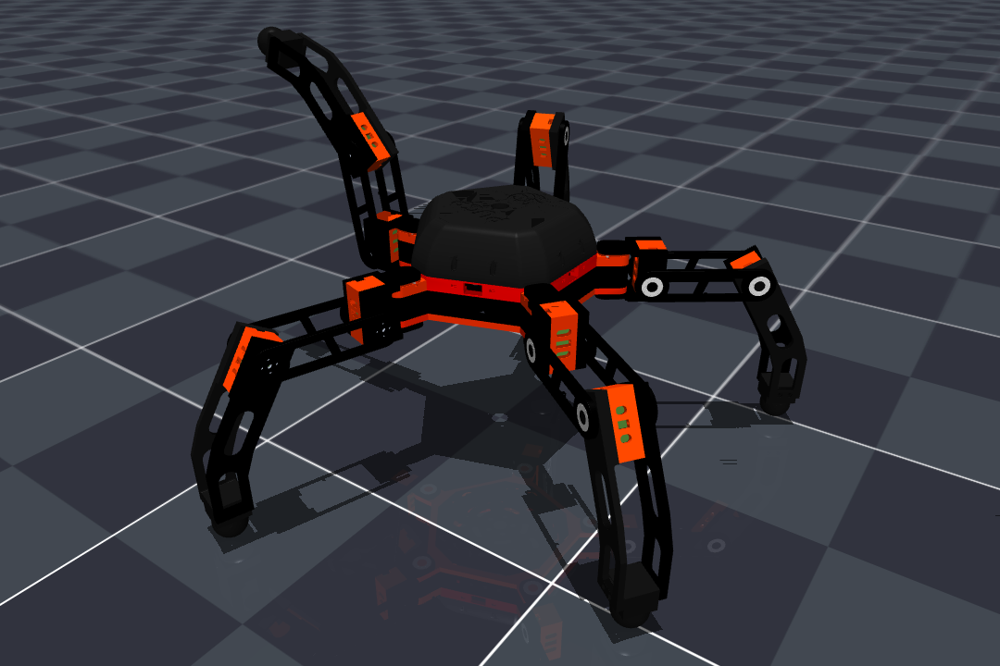
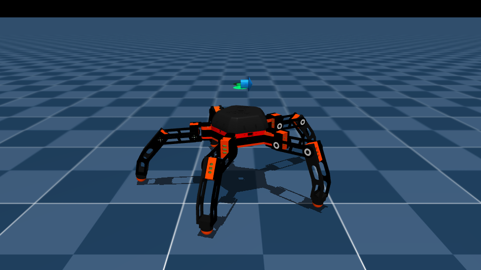
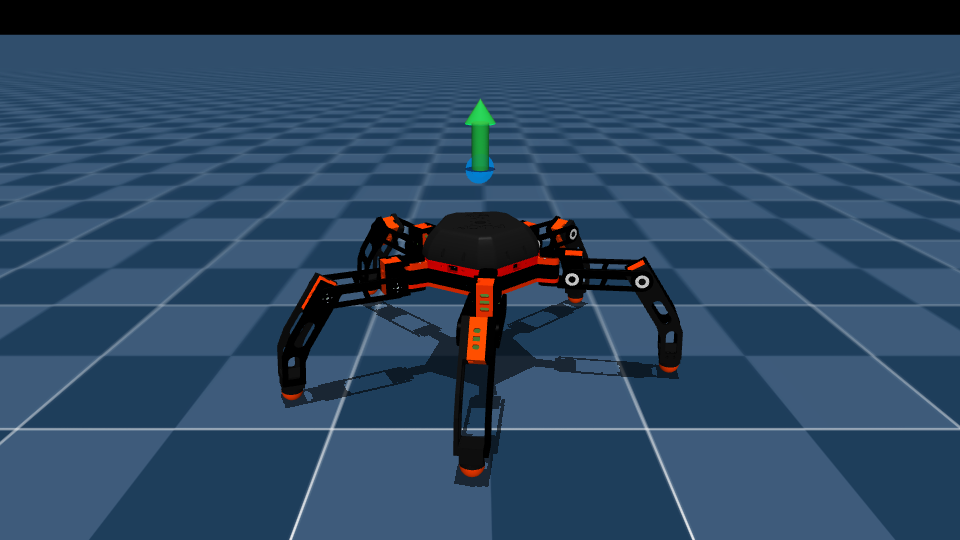
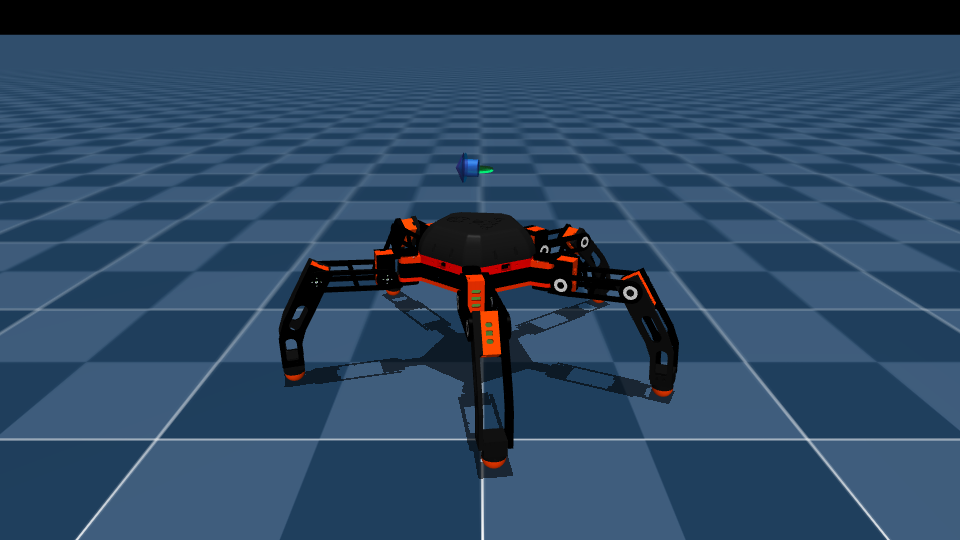

# Pentabot

> ¿Vas a trabajar en el proyecto desde otra computadora? Empieza por [`CONTEXTO.md`](CONTEXTO.md).

Robot caminante de **5 patas y 15 grados de libertad** (3 servos TowerPro MG995 por pata), modelado en
MuJoCo desde el CAD de Inventor y entrenado con aprendizaje por refuerzo (PPO) sobre
[mjlab](https://github.com/mujocolab/mjlab) / `unitree_rl_mjlab`.

<p align="center">
  
</p>

<p align="center"><i>Política entrenada en simulación: parado → avance → giro → desplazamiento lateral.</i></p>

## Imágenes de la simulación

| Vista isométrica | Vista superior |
|---|---|
|  |  |

| Frente | Lateral |
|---|---|
|  |  |

| Geometría de colisión (cascos convexos + pies esféricos) | Pose del CAD |
|---|---|
|  |  |

| Avance (0.16 m/s) | Giro (0.48 rad/s) | Lateral (0.16 m/s) |
|---|---|---|
|  |  |  |

## Características

| | |
|---|---|
| Patas | 5, a 72° entre sí |
| Articulaciones | 15: `Lk_hip_yaw`, `Lk_hip_pitch`, `Lk_knee` (k = 1…5) |
| Servos | TowerPro MG995 a 6 V (par de bloqueo ≈ 0.98 N·m) |
| Masa del modelo | 2.47 kg |
| Altura del torso de pie | 0.196 m |
| Controlador previsto | ESP32 DevKit + PCA9685 + IMU, mando DualSense |

## Estado

| Fase | Estado |
|---|---|
| Modelo MuJoCo (`model/`) | Hecho y validado (`scripts/test_modelo.py`) |
| Tarea de RL `Pentabot-Flat` | Entrenada: 3000 iteraciones, ~3 h, sin caídas |
| Control con mando PS5 en simulación | Funciona |
| Política sin encoders (para servos sin realimentación) | Pendiente |
| Ejecutar la política en la ESP32 | Pendiente |

Con la política actual, el robot sigue alrededor del 77 % de la velocidad pedida en el entrenamiento.
En la grabación del GIF pide 0.16 m/s y consigue 0.15 m/s.

**Limitación:** esta política usa como entrada `joint_pos` y `joint_vel`. El MG995 no tiene realimentación
de posición, así que todavía **no se puede usar en el robot real**. El plan está en
[`docs/PENDIENTE.md`](docs/PENDIENTE.md).

## Estructura

```
model/            pentabot.xml (robot) y scene.xml (robot + suelo); mallas STL en model/assets/
scripts/          visor, prueba del modelo y marcha de demostración en lazo abierto (solo MuJoCo)
mjlab/
  robot/          pentabot_constants.py: robot y actuadores MG995 para mjlab
  tarea/          tarea Pentabot-Flat: observaciones, recompensas y PPO
  scripts/        entrenar, ver la política, mando PS5 y grabar las imágenes de este README
politica/         model_3000.pt, policy.onnx y la configuración con la que se entrenó (params/)
docs/             MODELO.md (construcción y supuestos del modelo) y PENDIENTE.md (siguientes pasos)
imagenes/         renders de la simulación
```

## Uso rápido: solo el modelo en MuJoCo

```bash
bash setup.sh                # una vez: crea .venv con mujoco y prueba el modelo
bash ver.sh                  # visor con el robot de pie (sliders por servo)
bash ver.sh demo             # marcha de prueba en lazo abierto
python scripts/test_modelo.py   # estabilidad, carga por pie y pares (sin ventana)
```

## Entrenar y usar la política (con `unitree_rl_mjlab`)

La tarea se integra en [`unitree_rl_mjlab`](https://github.com/unitreerobotics/unitree_rl_mjlab) enlazando
las carpetas de este repo:

```bash
U=~/unitree_rl_mjlab
ln -s ~/pentabot              $U/src/assets/robots/Pentabot_MuJoCo
ln -s ~/pentabot/mjlab/robot  $U/src/assets/robots/pentabot
ln -s ~/pentabot/mjlab/tarea  $U/src/tasks/velocity/config/pentabot
cp ~/pentabot/mjlab/scripts/{jugar_mando.py,mando_ps5.py} $U/
```

Y registrar el robot al final de `src/assets/robots/__init__.py`:

```python
from .pentabot.pentabot_constants import (
  PENTABOT_ACTION_SCALE as PENTABOT_ACTION_SCALE,
)
from .pentabot.pentabot_constants import (
  get_pentabot_robot_cfg as get_pentabot_robot_cfg,
)
```

Después:

```bash
cd ~/unitree_rl_mjlab
unset PYTHONPATH; source ~/miniconda3/etc/profile.d/conda.sh; conda activate unitree_rl_mjlab

~/pentabot/mjlab/scripts/entrenar_pentabot.sh 4096           # entrenar (4096 entornos) + tensorboard
~/pentabot/mjlab/scripts/ver_pentabot.sh ultimo              # ver la última política
python jugar_mando.py ultimo --robot pentabot                 # manejarlo con el mando de PS5
python ~/pentabot/mjlab/scripts/grabar_marcha.py              # regenerar el GIF de este README
python ~/pentabot/mjlab/scripts/render_estatico.py            # regenerar las vistas estáticas
```

## Política entrenada (`politica/`)

- Actor MLP: 56 → 256 → 128 → 128 → 15, con ELU. El normalizador de las entradas va incluido en `policy.onnx`.
- Entradas: `base_ang_vel`(3), `projected_gravity`(3), `command`(3), `phase`(2), `joint_pos`(15),
  `joint_vel`(15), `actions`(15).
- Salida: `objetivo_articulación = 0.3 × acción` [rad], con la pose por defecto en q = 0. Funciona a 50 Hz.
- Rango de comandos: vx, vy ∈ [−0.2, 0.2] m/s; ωz ∈ [−0.6, 0.6] rad/s.

## Próximos pasos

1. Volver a entrenar **sin encoders**: el actor solo recibe el IMU, el comando, la fase y el historial de
   acciones, y se aleatoriza más el servo.
2. Ejecutar la red en C plano en la **ESP32**: bucle a 50 Hz, mando DualSense por Bluetooth y calibración por servo.

El detalle está en [`docs/PENDIENTE.md`](docs/PENDIENTE.md).
